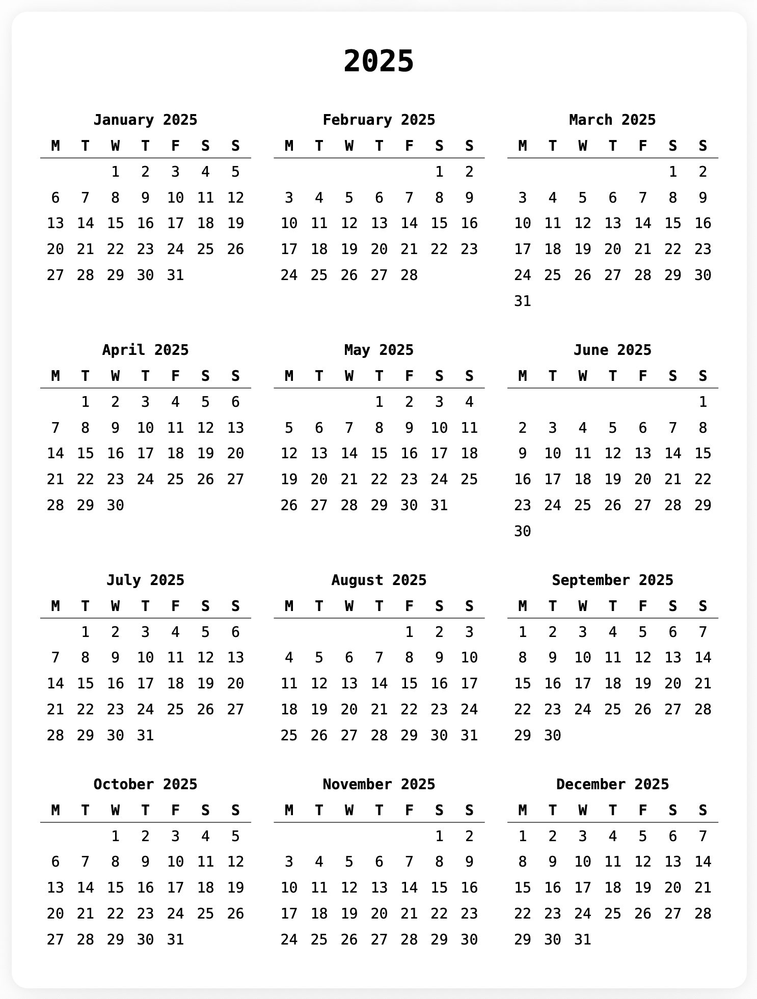
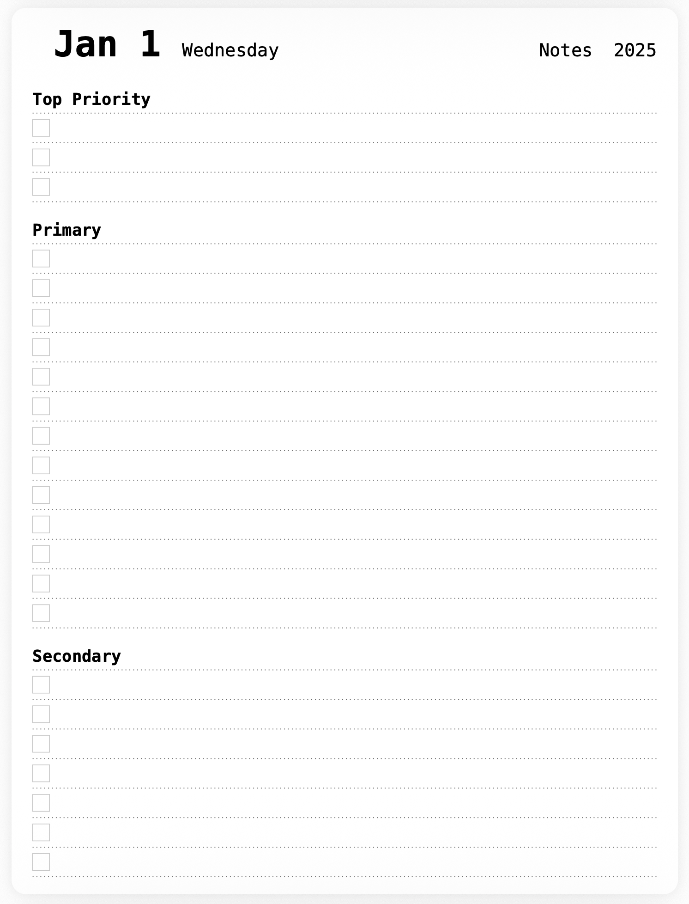
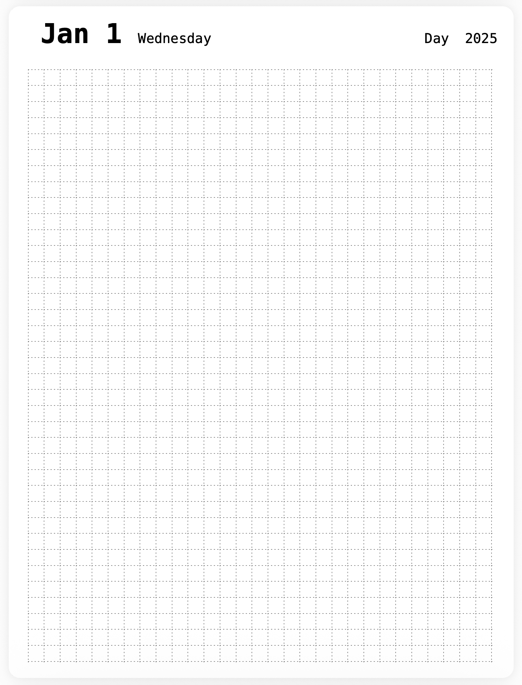
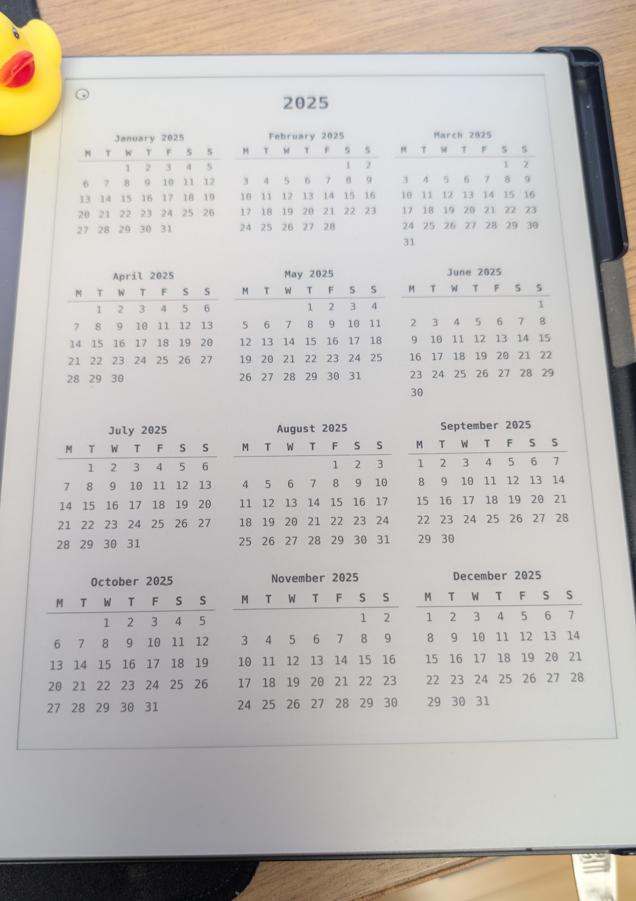
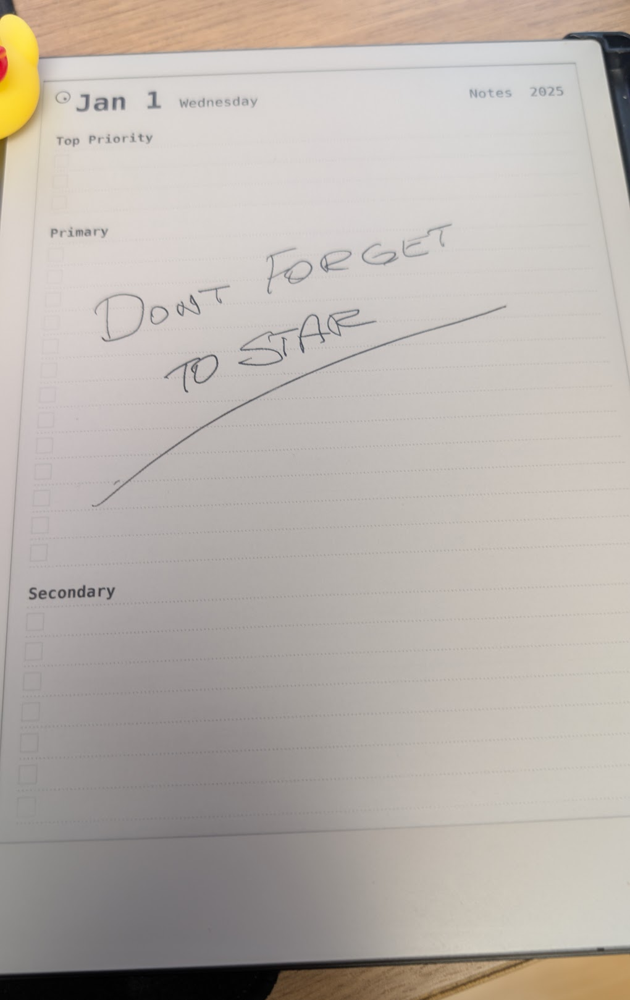
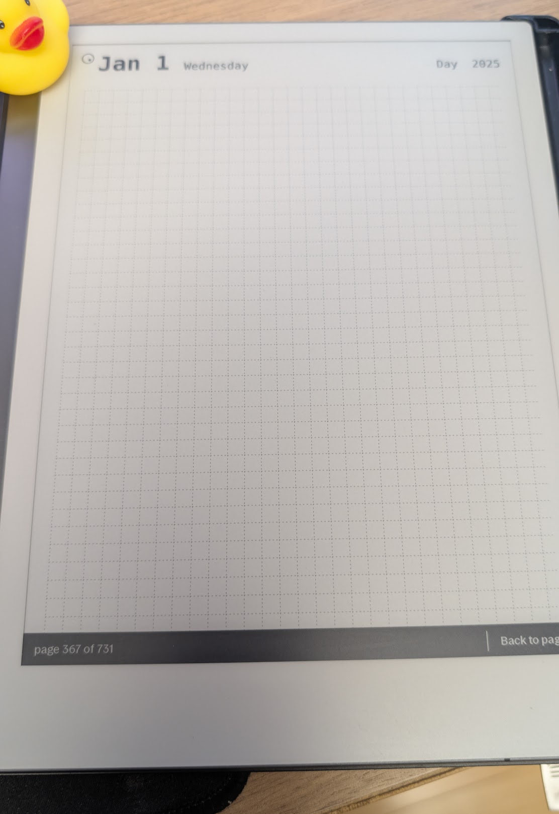

# reMarkable Daily Planner Generator

[](https://typst.app/)

A customizable daily planner system designed specifically for reMarkable tablet, however could very easily be adopted for any other screen size. In its default form it uses monospace font because I'm a software engineer. 

## Overview
This planner was designed by and for software engineering professionals who need a structured approach to managing their daily technical work. It combines traditional planning concepts with the unique needs of software development workflows.

## Structure
The planner generates a PDF with three main components:

### 1. Annual Calendar View (1 page)
- Year overview with navigation to any day
- Quick visual reference for planning sprints and releases

### 2. Daily Planner Pages (365 pages)
Structured for engineering workflows:

- Top Priority: For critical tasks that must be completed
- Primary: Primary tasks for the day, typically work related 
- Secondary: Other tasks, typically personal

Each page includes:
- Date and week number for sprint planning
- Navigation links to corresponding notes and calendar
- Configurable line spacing for different writing preferences

### 3. Daily Notes Pages (365 pages)
Meetings notes, etc.

## Download

Pre-built PDF planners are available for direct download:

- **[2025 Daily Planner](build/2025.pdf)** - Complete planner for the year 2025
- **[2026 Daily Planner](build/2026.pdf)** - Complete planner for the year 2026

Each PDF contains 731 pages (1 calendar + 365 daily planner pages + 365 daily notes pages) optimized for reMarkable 2/Pro tablets.

## Preview








## Configuration
All aspects of the planner are configurable through `config.typ`:

```typst
// Year for the planner
#let year = 2025

// Typography
#let font = "DejaVu Sans Mono"

// Device Support - Pre-configured for reMarkable devices:
// - reMarkable 1: 158mm × 210mm
// - reMarkable 2: 158mm × 210mm (default)
// - reMarkable Pro: 158mm × 210mm

// Page layout (optimized for reMarkable 2)
#let page = (
  width: 158mm,
  height: 210mm,
  margin_x: 5mm,
  margin_y: 5mm
)

// Header configuration
#let header = (
  height: 15mm,
  date_font_size: 24pt,
  weekday_font_size: 12pt,
  navigation_font_size: 12pt,
  // When your menu button is at the top-right corner, use 10mm, otherwise 5mm
  menu_margin_left: 10mm,
  // When your menu button is at the top-left corner, use 10mm, otherwise 5mm
  menu_margin_right: 5mm
)

// Line styling
#let lines_color = 100  // Gray level: 0=black, 255=white

// Daily planner sections (fully customizable)
#let daily_planner_sections = (
  (
    title_label: "Top Priority",
    title_font_size: 11pt,
    lines_count: 3,
    lines_height: 7mm,
    lines_style: "dotted",
    lines_color: lines_color,
    checkbox_show: true,
    checkbox_size: 4mm,
    checkbox_color: 200
  ),
  // ... additional sections
)

// Daily notes configuration
#let daily_notes = (
  lines_show: true,
  lines_size: 5mm,
  lines_style: "grid",
  lines_color: lines_color
)
```

## Building

Generate the complete planner using the build script:

```bash
./build.sh
```

Or compile directly with Typst:

```bash
typst compile index.typ
```

This creates `index.pdf` with all 731 pages ready for printing or digital use.

## File Structure

```
├── config.typ              # Global configuration
├── index.typ               # Main coordinator
├── lib/                    # Shared utilities
│   ├── calendar.typ        # Date calculations
│   ├── layout.typ          # Page layout system
│   └── link.typ            # Navigation links
└── views/                  # Page templates
    ├── calendar.typ        # Annual calendar view
    ├── daily-planner.typ   # Daily task planning
    └── daily-notes.typ     # Technical notes with grid
```

## License

MIT

## Contributing

Open a PR.
