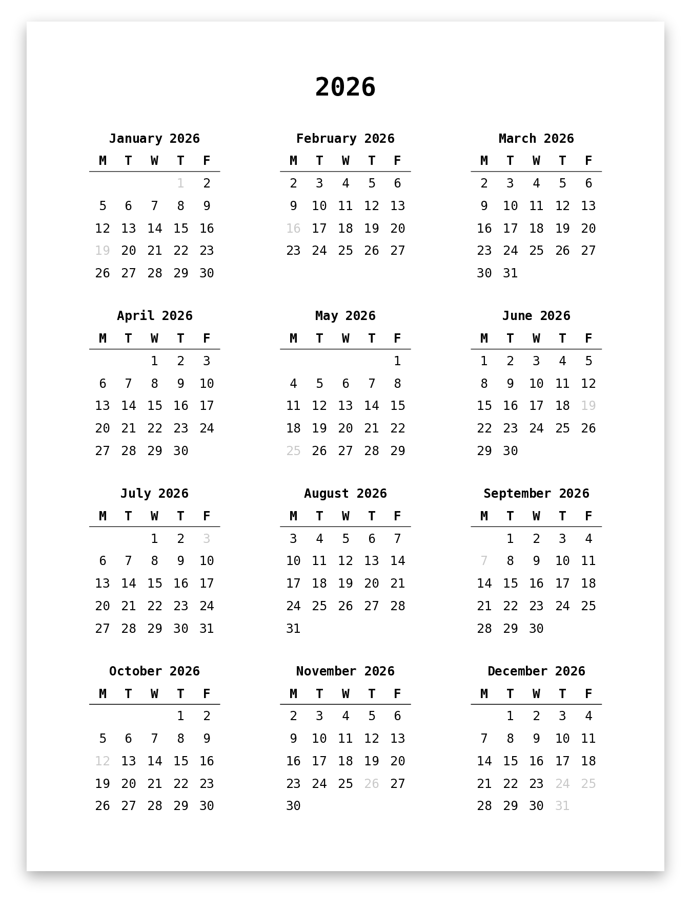
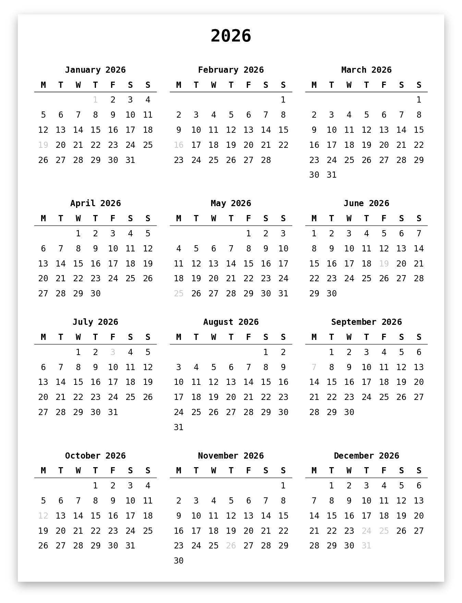
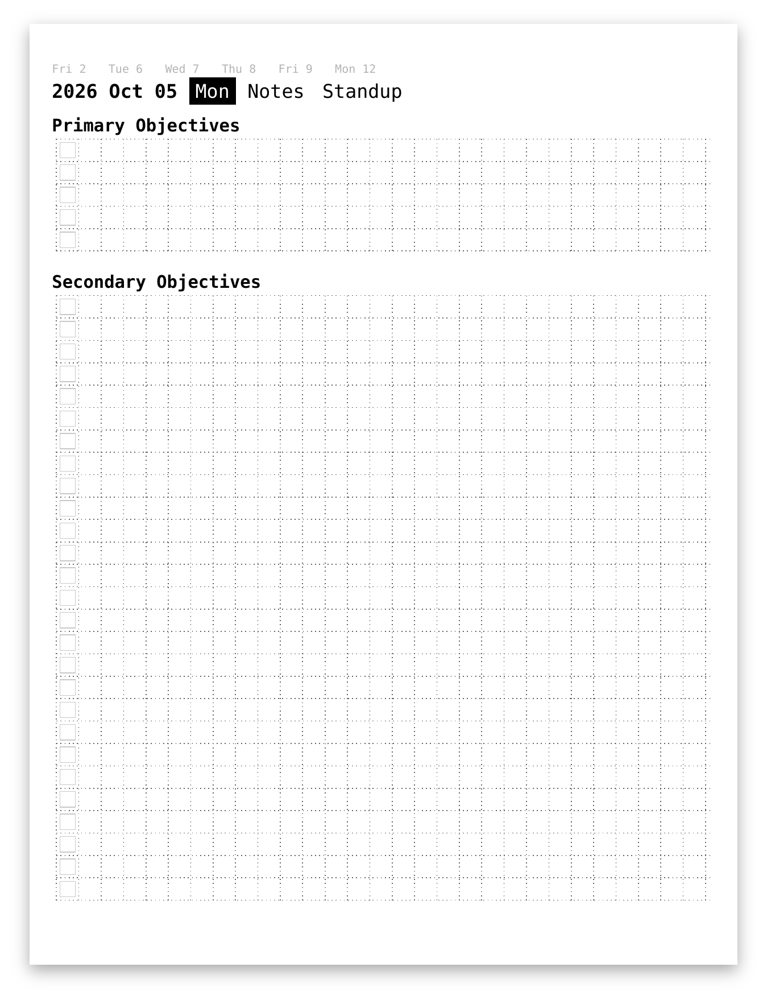
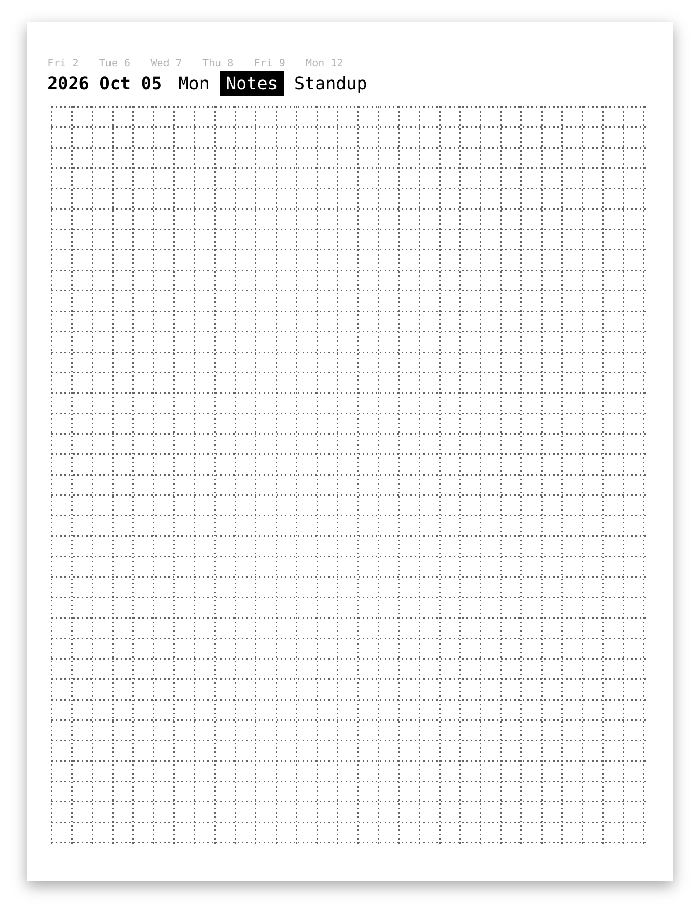
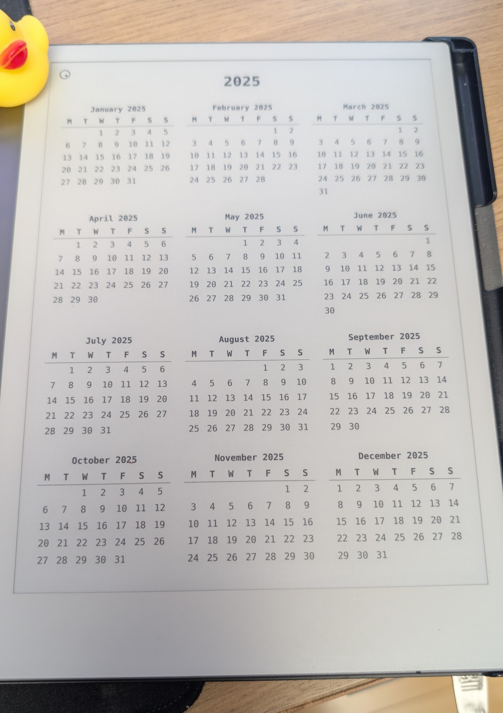
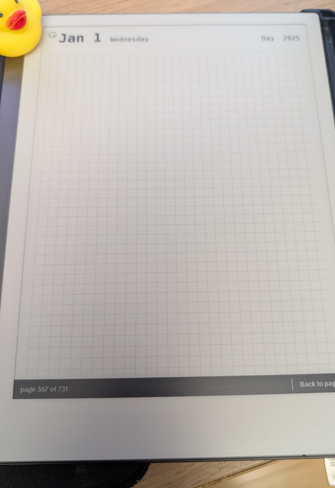

# reMarkable Daily Planner Generator

[](https://typst.app/)

A customizable daily planner system designed specifically for reMarkable tablet, however could very easily be adopted for any other screen size. In its default form it uses monospace font because I'm a software engineer. 

There are two main variants, one that excludes weekends (Sat/Sun) and one that includes them. Additionally, special dates (holidays, etc.) can be marked via a CSV file (USA and Canada, Ontario included as examples).

Customize navigation, typography, page geometry, and writing sections through `src/config.typ`.

## Structure
The planner generates a PDF with three main components and optional daily standup pages:

Pages are grouped to make day-to-day navigation easy: all Daily Planner pages form one chronological block, followed by all Daily Notes pages, then Daily Standup pages when enabled. Each block follows the same weekend setting. Appending standups keeps the existing Day and Notes page positions unchanged.

### 1. Annual Calendar View (1 page)
- Year overview with navigation to any day
- Quick visual reference for planning sprints and releases
- By default, weekends (Sat/Sun) are excluded from the calendar (use `--weekends=true` to include them)

### 2. Daily Planner Pages
Structured for engineering workflows:

- Primary Objectives: A compact grid for the day's main objectives
- Secondary Objectives: A larger grid for additional objectives

Each page includes:
- Date and weekday
- Navigation links to the same date's other page types and the annual calendar
- Configurable line spacing for different writing preferences

Special dates (from CSV) can also be visually marked in the calendar view and shown beneath the weekday in the daily header.

### 3. Daily Notes Pages
Meetings notes, etc.

### 4. Daily Standup Pages

Standup pages are disabled by default. Enable them with `--standup` or set `enabled: true` inside `STANDUP` in `src/config.typ`. Explicit `--standup=true` or `--standup=false` flags override the config value; omitting the flag preserves it. Both `just build` and `just build-all` accept these flags.

When enabled, there is one standup page per included date, with a grid matching Daily Notes below the daily navigation. The Standup tab identifies the page. Links return to that date's Day and Notes pages or the annual calendar. By default, gray date links show the previous included date first, followed by upcoming dates within the planner year, and preserve the current view. Disabled Standup tabs remain visible as plain text unless `show_disabled_standup` is false.

Customize line spacing, style, and color through `STANDUP` in `src/config.typ`. Set `title_show: true` to display a body heading, with configurable title text, font size, and gap. The line count adjusts to the remaining page height.

## Download

Pre-built PDF planners are available for direct download:

<!-- generated -->
- **[2026, No locale, No weekends](build/planner-no-weekends-no-locale-2026.pdf)**
- **[2026, No locale, Weekends](build/planner-weekends-no-locale-2026.pdf)**
- **[2026, USA, No weekends](build/planner-no-weekends-usa-2026.pdf)**
- **[2026, USA, Weekends](build/planner-weekends-usa-2026.pdf)**
- **[2026, Canada Ontario, No weekends](build/planner-no-weekends-canada-ontario-2026.pdf)**
- **[2026, Canada Ontario, Weekends](build/planner-weekends-canada-ontario-2026.pdf)**
<!-- /generated -->

## Preview

### Calendar view, no weekends


### Calendar view, weekends


### Day view


### Day notes view


### On device




## Configuration
The following settings are available in `src/config.typ`:

```typst
// Inputs and helpers
#import "lib/options.typ" as options
#import "lib/holidays.typ" as special_dates_lib

// Year for the planner (passed via `--input year=...`)
#let year = int(sys.inputs.at("year", default: "2026"))

// Weekends are excluded by default.
// Set `--input weekends=true` (or use `--weekends=true` in scripts) to include weekends.
// This affects both the daily pages and the calendar view.

// Typography
#let font = "DejaVu Sans Mono"

// Special dates
// Set by build scripts via `--country` (default: usa). Use `--country=none` to disable.
// Special date definitions are read from `dates-YYYY-COUNTRY.csv` in the repo root.
// CSV format: date,style,label (e.g. 2026-01-01,fade,New Year's Day)
// Supported styles: strike, fade

#let special_dates = special_dates_lib.special-dates(year, options.country())

// Calendar rendering configuration
#let calendar = (
  // Note: calendar.weekends means "include weekends".
  weekends: options.weekends(),
  // 0..255 gray level, where 0=black and 255=white.
  fade: 200,
  // line thickness for `style=strike`.
  strike_thickness: 0.8pt,
  // 0..255 gray level for `style=strike` (normal cells).
  strike_color: 100,

  // Horizontal gap between months in the year view.
  column_gap: if options.weekends() { 5mm } else { 15mm },
)

// Device Support - Pre-configured for reMarkable devices:
// - reMarkable 1: 158mm × 210mm
// - reMarkable 2: 158mm × 210mm (default)
// - reMarkable Pro: 158mm × 210mm

// Page layout (optimized for reMarkable 2)
#let page = (
  width: 158mm,
  height: 210mm,
  margin_x: 5mm,
  margin_y: 5mm
)

// Header configuration
#let header = (
  height: 15mm + 3pt,
  // Blank space above the navigation row for the top toolbar.
  top_gap: 4mm,
  date_font_size: 12pt,
  weekday_font_size: 12pt,
  // Font size for the special-day label shown beneath the weekday.
  day_label_font_size: 12pt * 60%,
  day_label_gap: 1mm + 2pt,
  navigation_font_size: 12pt,
  // Omit tokens to hide them; order determines their position.
  navigation_order: ("date", "day", "notes", "standup"),
  navigation_align: left, // left, center, or right
  navigation_gap: 4mm,
  notes_label: "Notes",
  standup_label: "Standup",
  show_disabled_standup: true,

  date_order: ("year", "month", "day"),
  date_separator: " ",
  date_weight: "bold",
  month_short: true,
  day_zero_pad: true,
  weekday_short: true,
  year_link: true, // month and day stay plain text
  year_link_padding: 2pt,

  active_style: "box", // "box", "underline", or "none"
  active_box_color: black,
  active_text_color: auto, // white for boxes, inactive color otherwise
  inactive_text_color: black,
  active_padding: 4pt,
  inactive_padding: 2pt,
  active_underline_thickness: 1pt,
  active_underline_offset: 2pt,
  active_underline_evade: false, // continuous underline

  // Quick jump links (left-aligned above the main header).
  // Shows the previous included date, then upcoming dates in the current page type.
  quick_jump_show: true,
  quick_jump_previous: true,
  quick_jump_same_view: true, // false sends date links to Day pages
  quick_jump_align: left,
  quick_jump_padding: 2pt,
  quick_jump_count: 5, // future dates only; zero allows previous-only navigation
  quick_jump_color: 180, // 0..255 gray level
  quick_jump_font_size: 12pt * 60%,
  quick_jump_gap: 5mm,
  // Navigation row height, reserved even when links are hidden.
  quick_jump_height: 4mm + 1pt,
  // Supported placeholders: {mon}, {month}, {day}, {dd}, {m}, {mm}, {dow}, {weekday}
  quick_jump_format: "{dow} {day}",

  // When your menu button is at the top-right corner, use 10mm, otherwise 5mm
  menu_margin_left: 5mm,
  // When your menu button is at the top-left corner, use 10mm, otherwise 5mm
  menu_margin_right: 5mm
)

// Line styling
#let lines_color = 100  // Gray level: 0=black, 255=white

// Shared writing defaults for every page type and Day section.
#let WRITING = (
  pattern: "grid",   // "lines", "grid", or "none"
  spacing: 7mm,      // Line gap or square grid cell size
  style: "dotted",  // "solid", "dotted", or "dashed"
  color: lines_color,
  thickness: 0.6pt,
)

// Daily planner sections (fully customizable)
#let daily_planner_sections = (
  (
    title_label: "Primary Objectives",
    title_font_size: 11pt,
    lines_count: 5,
    writing: WRITING,
    checkbox_show: true,
    // Number of checkboxes per row (default: 1). Grid checkboxes are centered
    // within cells; other patterns place them at the start of each column.
    columns: 1,
    checkbox_size: 4mm,
    checkbox_color: 200
  ),
  (
    title_label: "Secondary Objectives",
    title_font_size: 11pt,
    lines_count: 18,
    writing: WRITING,
    checkbox_show: true,
    checkbox_size: 4mm,
    checkbox_color: 200
  ),
)

// Daily notes configuration
#let daily_notes = (
  writing: (..WRITING, pattern: "grid", spacing: 5mm, thickness: 1pt),
)

// Optional standup heading and the same grid defaults as Notes.
#let STANDUP = (
  enabled: false,
  title_show: false,
  title: "Standup",
  title_font_size: 11pt,
  title_gap: 2mm,
  writing: daily_notes.writing,
)
```

Both navigation rows use `left`, `center`, or `right` alignment. `quick_jump_show: false` hides the entire gray row; `quick_jump_previous: false` hides only the back link. Tab labels and active styling apply to every daily view. Larger font sizes, labels, or padding may require increasing `height`, `quick_jump_height`, `navigation_gap`, or `day_label_gap` to preserve clearance.

All writing areas use the same `writing` settings. Set `pattern` to `"grid"`, `"lines"`, or `"none"`; `spacing` controls square cell size or horizontal line spacing. Set `style`, `color`, and `thickness` to change the strokes. Each Day section can override the defaults with, for example, `writing: (..WRITING, pattern: "grid", spacing: 5mm)`. Standup inherits Notes defaults; use `writing: (..WRITING, pattern: "lines")` inside `STANDUP` for horizontal lines, or `writing: (..daily_notes.writing, spacing: 6mm)` for an independent grid size. `lines_count` controls each Day section's height in rows; checkbox settings remain per section.

## Building

Install [Typst](https://typst.app/open-source/#download) and [just](https://just.systems/). Run `just` to list commands. The recipes forward arguments to the Bash scripts in `scripts/`.

```bash
# Generate the complete planner using the build script.
just build 2026

# Include standup pages and open the planner.
just build 2026 --standup --open

# Disable standups even when enabled in config.
just build 2026 --standup=false

# Include standups in all country/weekend variants.
just build-all 2026 --standup

# Include weekends.
just build 2026 --weekends=true

# Select special dates country (default: usa).
just build 2026 --country=usa

# Disable special date markings.
just build 2026 --country=none

# Open the generated PDF after building.
just build 2026 --open

# Watch for changes (auto-regenerate on save).
just build 2026 --watch

# Compile directly with Typst.
typst compile --root . --input year=2026 src/index.typ build/planner-2026.pdf

# Include standups (direct Typst).
typst compile --root . --input year=2026 --input standup=true src/index.typ build/planner-2026.pdf

# Watch directly with Typst.
typst watch --root . --input year=2026 src/index.typ build/planner-2026.pdf

# Include weekends (direct Typst).
typst compile --root . --input year=2026 --input weekends=true src/index.typ build/planner-2026.pdf

# Select special dates country (direct Typst).
typst compile --root . --input year=2026 --input country=usa src/index.typ build/planner-2026.pdf
```

Single builds write `build/planner-YEAR.pdf`. `--open` opens the PDF in the default macOS app. Batch builds write six country/weekend variants and update the download links above; they require [ripgrep](https://github.com/BurntSushi/ripgrep).

To render images, install [Poppler](https://poppler.freedesktop.org/) (`pdftoppm`) and [ImageMagick](https://imagemagick.org/) (`magick`, required for the default shadows):

```bash
just preview build/planner-2026.pdf 1:calendar 2:day 263:notes
```

Images go in `preview/`. With no arguments, `just preview` uses the 2026 USA batch PDFs. Use `just preview --help` for page specs, resolution, and shadow settings. See [AGENTS.md](AGENTS.md) for validation commands.

## File Structure

```
.
├── justfile                   # Build, preview, and validation commands
├── scripts/
│   ├── build.sh               # Build a single planner PDF
│   ├── build-all.sh           # Build all variants + update README links
│   └── preview.sh             # Render selected PDF pages as PNGs
├── build/                     # Generated PDFs; published variants are tracked
├── preview/                   # Preview images and device photos
├── dates-YYYY-usa.csv         # Special dates (example)
├── dates-YYYY-ca-on.csv       # Special dates (example)
└── src/
    ├── config.typ             # Global configuration
    ├── index.typ              # Main coordinator
    ├── lib/                   # Shared utilities
    │   ├── calendar.typ       # Date calculations
    │   ├── date-navigator.typ # Previous and upcoming date links
    │   ├── holidays.typ       # Special dates loading + helpers
    │   ├── layout.typ         # Page layout system
    │   ├── link.typ           # Navigation links
    │   ├── navigation.typ     # Date header and page tabs
    │   ├── options.typ        # Reads Typst CLI inputs
    │   └── sections.typ       # Shared writing sections and checkboxes
    └── views/                 # Page templates
        ├── calendar.typ       # Annual calendar view
        ├── daily-planner.typ  # Daily task planning
        ├── daily-notes.typ    # Notes pages
        └── daily-standup.typ  # Daily standup pages
```

## License

MIT

## Contributing

Open a PR.
